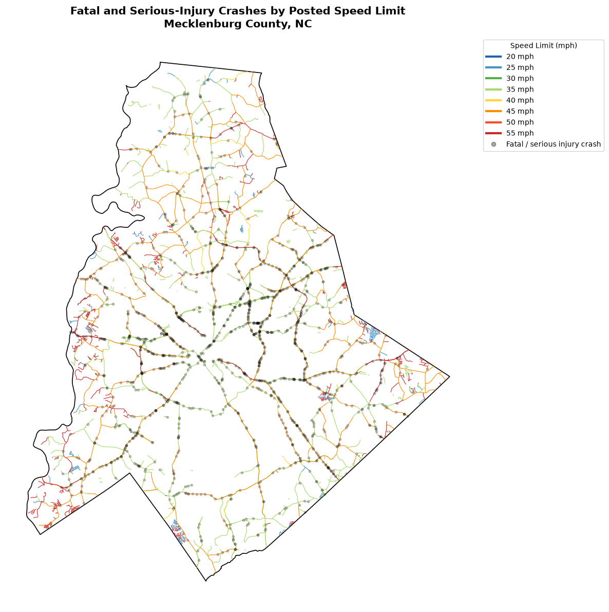
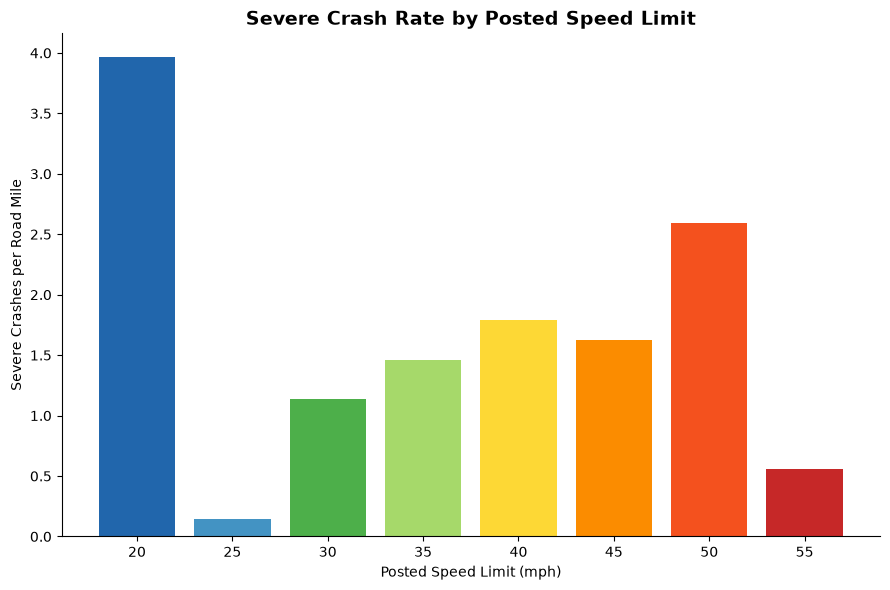

# Posted Speed Limits and Severe Crash Rates in Mecklenburg County

## Problem Definition

### Research Question: Among NCDOT state-maintained roads, not including interstate roads, in Mecklenburg County, how does the rate of fatal and serious-injury crashes vary by posted speed limit?

Driving is something most people encounter every day, and severe crashes remain an important road-safety concern. Therefore, I decided to study whether roads with different speed limits experience different rates of sever car crashes. I decided to exclude interstate highways, as my goal was to understand where the most severe accidents occurred on regular roads. With these findings, I believe we can have a better understanding of the dangers of driving as well as maybe finding ways to improve the safety of roads in Mecklenburg County.

## Data Description

For my data, I pulled from a variety of different ArcGIS APIs, each containing different mapping data. All of the tables from which I pulled data was built and shared by the North Carolina Department of Transportation (NCDOT), making them a reliable source to gather data from.

There was one table with records of every fatal or serious injury crash from 2016 to 2025 in North Carolina that held around 54,000 records. Each row recorded data about a specific fatal or serious injury crash, with very detailed records about the location, number of vehicles involved, alcohol involvement, etc.

There was another table with the different speed limits of state-maintained roads in North Carolina with over 100,000 records. Each row was a segment of a road that held a specific speed limit. There could be multiple rows corresponding to the same road, but each row would hold the coordinates for a segment of that road with a different speed limit.

Finally, there was a table with basic county data for all 100 counties in North Carolina. It essentially hold the coordinates to build the polygon structure of a county onto a map.

The main variables I was interested in were the coordinates of roads and crashes for mapping purposes, and the posted speed limit for each road. Posted speed limit was operationalized using the "SpeedLimit" field associated with each state-maintained road segment. Severe crash rate was operationalized as the number of fatal and serious-injury crashes matched to a given speed-limit category divided by the total miles of roadway in that category.

## Data Cleaning and Preparation

Despite the APIs having data for all of North Carolina, my queries to the server focused on data solely for Mecklenburg County. This helped to narrow the number of records I pulled from the API and allow me to work with a more manageable dataset.

Towards the end of the project, one of the ArcGIS API for the speed limit data became impossible to query from. Because I had previously retrieved and saved the data locally, I used the stored version of the dataset for the remainder of the analysis rather than making additional API requests.

In addition to Mecklenburg County, I also queried road data from the surrounding counties in order to find roads that crossed the border between counties, and then cut them off so that only the part that was in Mecklenburg County was kept. I also ensured that only records for state-maintained roads, not including interstate roads, was kept within the dataset.

Because the original geographic data used latitude and longitude coordinates, I projected the GeoDataFrames to EPSG:2264, a North Carolina projected coordinate system measured in feet. This allowed distances, 50-foot tolerances, and road lengths to be calculated using appropriate spatial units.

There were some missing coordinates from the crash dataset, and those rows were removed since the coordinates were an essential part of the analysis and mapping process.

For the crash data, a small number of crashes classified by NCDOT as within Mecklenburg County had coordinates that fell slightly outside the Mecklenburg County boundary. To deal with this issue, I decided to keep any crashes that were within a 50 foot radius of the Mecklenburg County border, as I believed that those crashes were within the margin of error for the coordinates provided by the NCDOT dataset and the mapping abilities of the GeoPandas library. Anything farther than the 50 foot limit was removed from the dataset.

Also the dataset I used for the speed limits of roads only contained information regarding roads that are maintained by the state, meaning any roads maintained by local governments was not included in the dataset. This meant that many crashes listed within the crash dataset did not have a road to connect to. I decided once again on a 50 foot cutoff to connect a crash point to its nearest road. If a state-maintained road was not within 50 feet of a crash, that crash was removed from the dataset.

##  Visualizations and Insights

*Figure 1. Fatal and serious-injury crashes and posted speed limits on selected
state-maintained roads in Mecklenburg County.*

The first visualization maps fatal and serious-injury crashes across Mecklenburg County alongside state-maintained roads colored by posted speed limit. This provides geographic context for where severe crashes occurred and how those locations correspond to different speed-limit categories.

*Figure 2. Fatal and serious-injury crashes per road mile by posted speed limit.*

Raw crash counts alone would not provide a fair comparison because Mecklenburg County contains different amounts of roadway at each posted speed limit. I therefore calculated the number of severe crashes per road mile for each speed-limit category. This normalizes the crash count by the amount of roadway represented in each category.

## Storytelling and Narrative 

The results did not show a consistent relationship in which severe crash rates increased as posted speed limits increased. Crash rates generally increased between 25 and 40 mph, decreased slightly at 45 mph, increased substantially at 50 mph, and then decreased at 55 mph. This suggests that posted speed limit alone does not explain the variation in severe crash rates across the roads included in this analysis.

However, there are some issues with the data that does provide some unusual conclusions. The severe crash rate per road mile at 20 mph is almost at 4, towering over the rest of the speed limits. This is not because so many severe crashes occur at 20 mph, but that there is one severe crash at that speed limit, and this occurred because a car hit a pedestrian. Because there is only a quarter mile of state-maintained roads at 20 mph, the ratio is very high. This makes it easy to misunderstand what the bar plot is showing, thinking that there are many severe crashes at 20 mph when that is not the case.

## Limitations, Ethics, and Reflection

There are some limitations with this dataset. For one, this data does not include all roads in Mecklenburg County, only state-maintained roads. Over 50% of the crashes from the dataset were removed because they could not be mapped to a road within 50 feet. This would have a very high impact on the final conclusion of this analysis, and as such needs to be taken into consideration. For future analysis on this topic, a dataset with all roads in Mecklenburg County would be preferred.

Another limitation was the fact that the speed limit data was taken from a separate dataset than the crash data. There was no linking column to join the two data sets and confirm which crashes occurred on which roads. I had to do the best I could by using a 50-foot range to attach a crash to the nearest road, but this could inevitably lead the crash to be attached to the wrong road.

An important ethical consideration is avoiding conclusions that imply posted speed limit alone causes severe crashes. It can range from poor weather conditions to impairment due to illegal substance use to high traffic volume. None of these factors were considered in this analysis, but they could absolutely affect the chances of a severe car crash. A lot of this data was available to me, but due to time constraints and the scope of my research question, I did not lead my analysis in that direction. I would be very interested in studying other potential factors of severe car crashes in a future analysis of this data.

Due to unforeseen circumstance, the API for the speed limit data became unavailable during the project and part of the analysis relied on a previously downloaded version of the data. As a result, any updates made to the source dataset after it was downloaded would not be reflected in this analysis.

## Code and Transparency 

As I am not very familiar with ArcGIS or working with mapping data, there was the usage of ChatGPT's GPT-5.6 Sol to help generate code to manipulate the data using GeoPandas, and successfully pull from the ArcGIS API. I also used ChatGPT to help enhance some of my visualizations by using techniques beyond the generic matplotlib functions. The purpose of using ChatGPT was not to brainstorm ideas but to execute on my own ideas through the help of code generation. 

The Jupyter Notebook used for this analysis is available [here](Research.ipynb).

## Data Source & References

- North Carolina Department of Transportation. (n.d.). NC fatal and serious injury crashes [Data set]. ArcGIS Online. https://www.arcgis.com/home/item.html?id=967bdaaadb4a4c1eb3e3d4e849b43719
- North Carolina Department of Transportation. (n.d.). North Carolina speed limits map [Data set]. ArcGIS Online. https://www.arcgis.com/home/item.html?id=978abf2f2fe341c78f6d52636a60ebff
- North Carolina Department of Transportation. (n.d.). NCDOT county boundaries [Data set]. ArcGIS Online. https://www.arcgis.com/home/item.html?id=d192da4d0ac249fa9584109b1d626286
