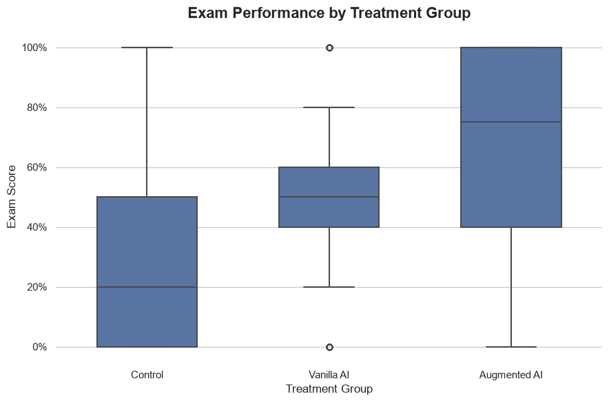
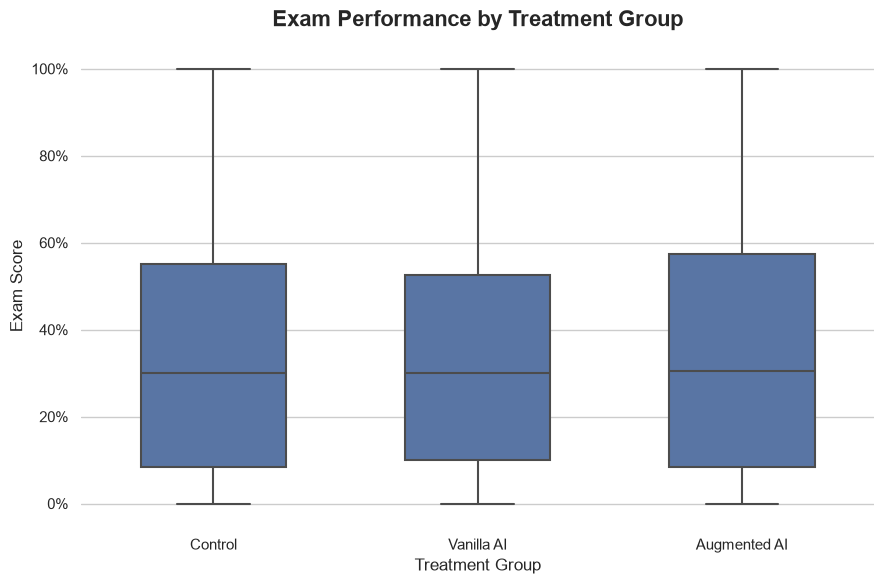
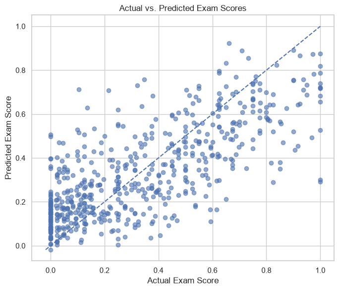
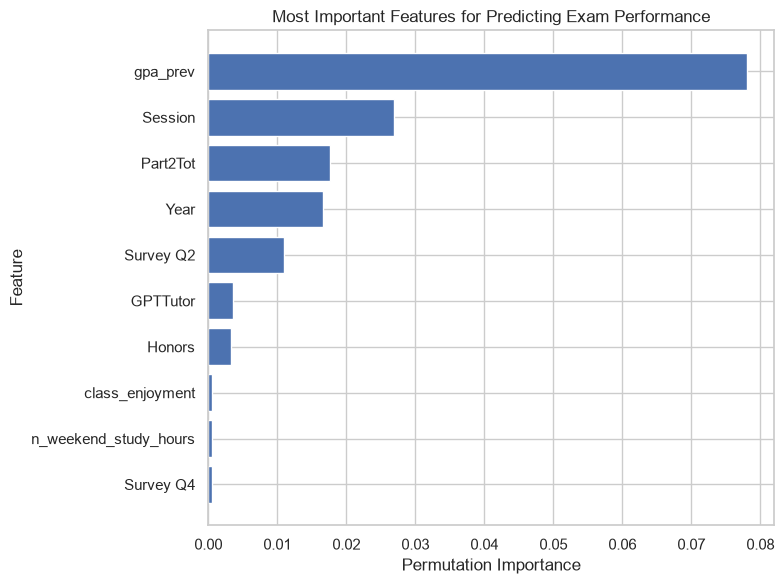
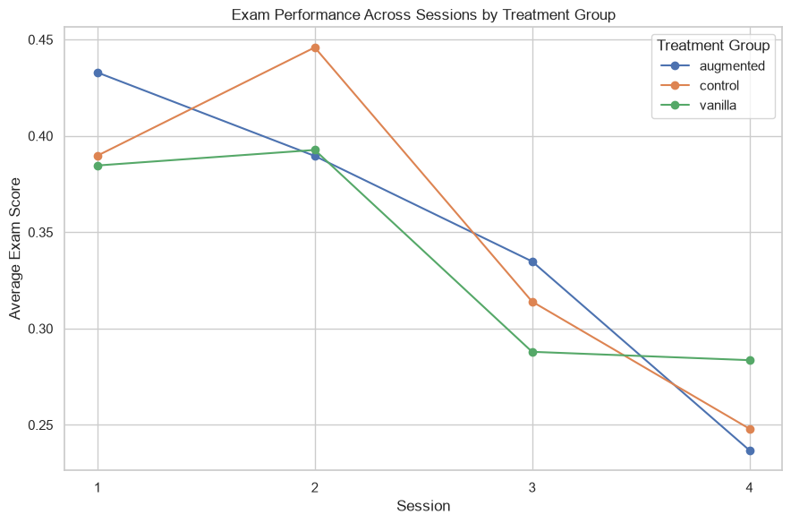

# Effects of Generative AI on Student Learning

## 1. Background

Technology has slowly become an integral part of the education system. Many students are given a laptop or ipad from their schools in the United States in order to complete assignments and participate in class. In just the past few years new technologies has lead to the widespread use of generative AI.

As soon as generative AI became mainstream, many students started to utilize it to help them in their classes. Some used it as a tool for learning, taking advantage of its vast knowledge to learn from it. There are many cases where generative AI is able to explain complicated problems in a much simpler way. Others used it as a tool for cheating, letting generative AI do their homework, write papers, and even take exams for them. With how widely technology has been integrated into education, it is very easy to use generative AI to go through class work and assignments without actually learning anything.

### Research Question: Does generative AI help students learn and improve their academic performance?

I began this project to answer this research question. In order to get a better understanding, I explored data from a high-school experiment in Turkey and built a regression model to predict students’ independent exam scores.

The analysis of this data had one main goal: examine how practice and exam performance differ across AI treatment groups, and determine which features help predict exam performance. These findings could help educators and researchers understand what to measure when evaluating AI-based learning.

## 2. Understanding the Data

I used the _ai-learning_ dataset from the Carnegie Mellon University Statistics & Data Science Data Repository (Sagasta Pereira, 2026). It comes from a study involving Turkish high-school students in their math class. The dataset contains **3,255 student-session observations, 943 unique students, and 31 original columns**. A row represents a student’s results in one session, and a student can appear in up to four sessions.

The three treatment groups are control, vanilla AI, and augmented AI. The control group had no access to generative AI in theri sessions. The vanilla group had access to a standard ChatGPT interface to help answer questions. the augmented tool had access to an enhanced ChatGPT interface that was designed to help specifically with the topics covered in the session. Treatment was assigned at the classroom level, and classrooms retained their assignments across sessions. A student could only be a part of the same group across all session.

Two scores are important for this analysis:

| Variable   | Role in this project                         |
| ---------- | -------------------------------------------- |
| `Part2Tot` | Assisted practice score; used as a predictor |
| `Part3Tot` | Unassisted exam score; the prediction target |

Other available features describe prior GPA, grade level, study habits, educational support, household characteristics, and students’ survey responses. Both scores are recorded as proportions, so a value of 0.70 corresponds to 70% of the available score. All of the continuous data has been standarized to a value between 0 and 1, while most other count data is realtively low (below 10).

There are 5 survey questions included in the data that were asked after the students took the unassisted exam after each session. The survey covered topic related to the study session as well as the students' perception of their exam performance.

## 3. Exploratory Data Analysis

The clearest descriptive pattern was the difference between practice and exam scores. The notebook produced the following averages across recorded sessions:

| Treatment group | Mean practice score | Mean independent exam score |
| --------------- | ------------------: | --------------------------: |
| Control         |              31.62% |                      34.81% |
| Vanilla AI      |              49.48% |                      33.80% |
| Augmented AI    |              67.45% |                      35.13% |

Practice performance differed significantly across groups, while average independent exam performance was much closer. This led me to focus on the independent exam as the prediction target as assisted performance alone would give an incomplete picture of the effects of generative AI on learning.

<figure markdown="1">

*Figure 1. Distribution of the assisted practice exam score based on the treatment group*
</figure>

The independent exam scores varied widely. Their overall mean was 34.61%, their median was 30.00%, and values ranged from 0% to 100%.

<figure markdown="1">

*Figure 2. Distribution of the unassisted exam score based on the treatment group*
</figure>

### Missing Data

| Variables    | Missing Values |
| ------------ | -------------- |
| Survey Q1    | 261            |
| Survey Q2    | 271            |
| Survey Q3    | 324            |
| Survey Q4    | 343            |
| Survey Q5    | 561            |
| Previous GPA | 54             |
| Grader       | 1              |

Missingness was heavily concentrated in the survey columns. There were hundreds of rows of missing data for the survey questions. I did not want to give the median value or the most frequent value for this missing data, since I felt that these were very important features. So I decided in the end to remove the rows with missing data from the survey questions I chose to use in the model.

The missing GPA values persisted across all sessions for the affected students. There were only 15 students that were missing GPA, but across all of their sessions it added up to 54 rows of data. Because these students were missing GPA from all of their sessions, it was not possible to assume their GPA by looking at one of their other sessions.

## 4. Data Preparation & Feature Selection

There were some survey responses that were spelled slighlty differently or had different capitalization, so I standardized survey responses so equivalent responses were treated as the same category. The uninterpretable responses were converted to missing values.

Prior GPA was filled using median imputation, with an additional indicator recording whether GPA had been missing. This kept those observations without treating an imputed value as an original measurement from the expirement. Session was one-hot encoded, allowing the model to note differences in session performance. Selected survey responses were ordinal encoded in their response order. The remaining selected numeric variables were passed through without scaling.

The final workflow used 20 input features, including survey questions Q1, Q2, and Q4. I chose these questions because I felt that they related to the students' perception of their exam performance as well as their perception of how much they learned in the sessions. Rows missing any response from those three questions were excluded from the dataset, leaving **2,899 observations from 927 students**. Student ID was used for grouping rather than as an input. Class, teacher, grader, the treatment-name column, household size, number of household children, parental education, and Q3/Q5 were excluded from the features used in the model. These features were demeed to be unrelated to academic performance.

The rest of the features from the dataset were kept as they were all either related to academic performance, or I was interested in their affect on the independent exam score. One such feature was the gender feature, which should not really have an effect on academic performance, but I was curious what its relationship would be. The way the model determined the treatment group was through the indicators `GPTBase` and `GPTTutor`.

The purpose of the feature set was to combine academic background, practice performance, treatment group, and student context. The survey extension tested whether students’ own assessments provided additional information. This focuses the final model on performance, study habits, educational support, and selected student characteristics.

Because students appeared repeatedly, I split the data by student using `GroupShuffleSplit`, with approximately 20% of students assigned to testing. In the survey dataset, this produced 741 training students and 186 testing students, with no student shared between the two sets. Five-fold `GroupKFold` similarly kept each student’s sessions together during cross-validation.

## 5. Model Comparison & Hyperparameter Tuning

I created a mean-prediction baseline model using `DummyRegressor`, then compared Linear Regression, Ridge, Random Forest, and Gradient Boosting. Linear models provided a straightforward reference, while tree ensembles could capture nonlinear relationships.

I evaluated performance using three regression metrics:

- **MAE:** the average absolute prediction error, in score units.
- **RMSE:** an error measure that gives greater weight to large mistakes.
- **R²:** The explained variation of the targegt variable by the features

The supplied survey-model results were:

| Model             | Mean CV R² | Mean CV MAE | Mean CV RMSE |
| ----------------- | ---------: | ----------: | -----------: |
| Mean baseline     |    -0.0044 |      0.2413 |       0.2838 |
| Linear Regression |     0.4826 |      0.1643 |       0.2036 |
| Ridge             |     0.4824 |      0.1644 |       0.2036 |
| Random Forest     |     0.5185 |      0.1559 |       0.1964 |
| Gradient Boosting |     0.5350 |      0.1525 |       0.1930 |

All trained models outperformed the baseline. The tree ensembles also achieved lower errors than the linear models in this comparison. This is consistent with useful nonlinear structure, although the score differences alone do not determine which interactions account for the improvement.

A comparison was done between a model that included the survey questions and a model that did not include the questions as features. Both models were built on a dataset that had dropped rows with missing values for the survey questions involved. The models with the survey questions as features performed slightly better, around 1 MAE lower, so it was decided to keep the questions as features in the model.

Gradient Boosting was the strongest candidate in the updated initial comparison on all three metrics. I then tuned it using `GridSearchCV`, minimizing the RMSE within the training set. The search evaluated 375 parameter combinations across five folds, for 1,875 validation fits, followed by refitting the selected pipeline.

| Selected parameter               | Value |
| -------------------------------- | ----: |
| Number of Trees (`n_estimators`) |   150 |
| Learning rate                    |  0.05 |
| Maximum tree depth               |     4 |
| Minimum samples per leaf         |     5 |

The selected model achieved an averaged cross validation RMSE of **0.1909**. On the test split of 573 observations from 186 students, its reported results were:

| Metric | Final test result |
| ------ | ----------------: |
| R²     |            0.5445 |
| MAE    |            0.1532 |
| RMSE   |            0.1934 |

The test RMSE was close to the cross validation RMSE, differing by approximately 0.0025 score units, or 0.25 percentage points. This is encouraging, as it means the model was not overfitted and can be used for inferencing with expectations of similar results.

The final test MAE corresponds to an average absolute error of **15.32 percentage points**. Test R² was approximately 0.54, meaning the model accounted for about 54% of test-score variation relative to a constant prediction of that test set’s mean. This still leaves substantial uncertainty in individual predictions.

For interpretation, an MAE of 0.15 means an average absolute error of 15 percentage points on this score scale. It does not mean the model is “85% accurate.”

<figure markdown="1">

*Figure 3. Scatter plot of actual vs. predicted exam scores with a 45 degree line showing where perfectly predicted points would land*
</figure>

Predictions generally increased with actual scores, but the plot shows considerable spread. observations with a score of zero were often assigned positive predictions, while observations of perfect exam scores were generally predicted below 1. This suggests a trend toward middle scores and difficulty predicting extreme outcomes.

## 6. Model Evaluation & Interpretation

I used permutation importance to investigate which inputs supported the final model’s predictions. This method shuffles one input at a time and measures the resulting decrease in predictive performance.

The supplied chart ranks **prior GPA** first, followed by **session, practice exam score, grade level, Survey Q2, Augmented AI indicator, and honors indicator**. This suggests that academic background and session context provided important predictive information. There was a slight bit of importance placed on whether a student was in the Augmented AI group, but it was not as high as others. Q2 also asks students how well they believe they performed on the quiz, so its importance must be taken into account with the fact that it was asked after the exam was taken.

<figure markdown="1">

*Figure 4. Permutation Importance chart in descending order of the features importance*
</figure>

Permutation importance was calculated on the final Gradient Boosting pipeline using the test split, RMSE scoring, and ten repetitions.

| Feature                         | Mean increase in RMSE | SD across shuffles |
| ------------------------------- | --------------------: | -----------------: |
| Previous GPA                    |                0.0781 |             0.0040 |
| Session                         |                0.0269 |             0.0029 |
| Practice score                  |                0.0177 |             0.0025 |
| Grade level                     |                0.0165 |             0.0034 |
| Perceived quiz performance (Q2) |                0.0110 |             0.0025 |

For example, shuffling prior GPA increased RMSE by about 7.81 percentage points on average. These increases are neither shares of explained variance nor treatment effects. The SD describes variation across shuffles, not a confidence interval accounting for repeated students.

Importance indicates how the fitted model uses a feature; it does not mean causation or show whether increasing that feature increases the predicted score. Correlated predictors can also share information, reducing the apparent importance of individual features. A low treatment-indicator importance therefore does not prove that AI had no effect.

Session importance motivated a follow-up question: **Did students’ exam scores change over successive sessions, and did those patterns differ by treatment group?**

<figure markdown="1">

*Figure 5. Mean independent exam score by session and treatment group*
</figure>

| Session | Mean independent exam score | Recorded observations |
| ------- | --------------------------: | --------------------: |
| 1       |                      40.28% |                   852 |
| 2       |                      40.93% |                   791 |
| 3       |                      31.31% |                   834 |
| 4       |                      25.51% |                   778 |

The overall mean was similar in Sessions 1 and 2, and then lower in Sessions 3 and 4. Session 4’s mean was 14.76 percentage points below Session 1’s. The plot showed lower Session 4 averages than Session 1 in all three groups, although the trajectories differed. For example, control performance peaked in Session 2, while vanilla AI’s mean changed little between Sessions 3 and 4.

I could not conclude why the relationships between exam scores and sessions were like this. My best guesses are that later sessions may cover different material or have higher difficulty, which lead to lower exam scores.

## 7. Final Thoughts & Limits

The results show why evaluating AI-based learning requires careful thought. In this dataset, the large differences in practice exam scores were followed by much smaller differences in raw exam averages. The predictive results also suggest that students’ academic background and session context are useful for understanding performance.

The tuned Gradient Boosting model achieved a reported test R² of 0.5445 and MAE of 15.32 percentage points. Session averages declined in the later assessments, but that descriptive pattern cannot establish a decline in learning or identify its cause.

Several limitations affect how these findings should be used. The study represents a particular school, in a particular country, using a particular teaching style. Performance somewhere else may differ. Excluding the incomplete surveys can also introduce selection bias. Surveys are self-reported, and post-exam responses restrict when the survey model could be used. It would be nice to have a more complete set of survey responses, as well as more questions that could delve deeper into how the students use generative AI for school.

Bastani et al. (2025), whose experiment supplied this dataset, found that unrestricted AI assistance could improve assisted performance while harming subsequent independent performance. In another setting, Kestin et al. (2025) found that a deliberately designed AI tutor improved learning relative to an active-learning class in college physics. These studies involved different students and instructional designs, so their results should not be treated as interchangeable. Together, they motivate examining how an AI tool is used and how learning is assessed. UNESCO’s guidance also emphasizes human oversight, privacy, and educational purpose when adopting generative AI (Miao & Holmes, 2023).

In the end, the model should not determine grades, restrict opportunities, or define the students’ ability. Educational use would require stronger validation, privacy safeguards, and evaluation of errors across relevant student groups. Individual student identifiers should not appear in public prediction examples.

## References & Code

- Bastani, H., Bastani, O., Sungu, A., Ge, H., Kabakcı, Ö., & Mariman, R. (2025). Generative AI without guardrails can harm learning: Evidence from high school mathematics. _Proceedings of the National Academy of Sciences, 122_(26), e2422633122. https://doi.org/10.1073/pnas.2422633122
- Kestin, G., Miller, K., Klales, A., Milbourne, T., & Ponti, G. (2025). AI tutoring outperforms in-class active learning: An RCT introducing a novel research-based design in an authentic educational setting. _Scientific Reports, 15_, Article 17458. https://doi.org/10.1038/s41598-025-97652-6
- Miao, F., & Holmes, W. (2023). _Guidance for generative AI in education and research._ UNESCO. https://www.unesco.org/en/articles/guidance-generative-ai-education-and-research
- Sagasta Pereira, V. (2026, June 19). _Can generative AI harm student learning?_ CMU S&DS Data Repository. https://cmustatistics.github.io/data-repository/technology/ai-learning.html

**Jupyter Notebook Code:** [Link](https://github.com/Joey019/data-science-portfolio/blob/main/project/project2/Research.ipynb)

## AI Usage

I used Claude Code to help with the design of my website and all the code involved in that process. I used ChatGPT's GPT-5.6 Sol to help support my ideas with code generation. All of the brainstorming and analysis was done by me, but a lot of the implementation in python was guided by ChatGPT.
